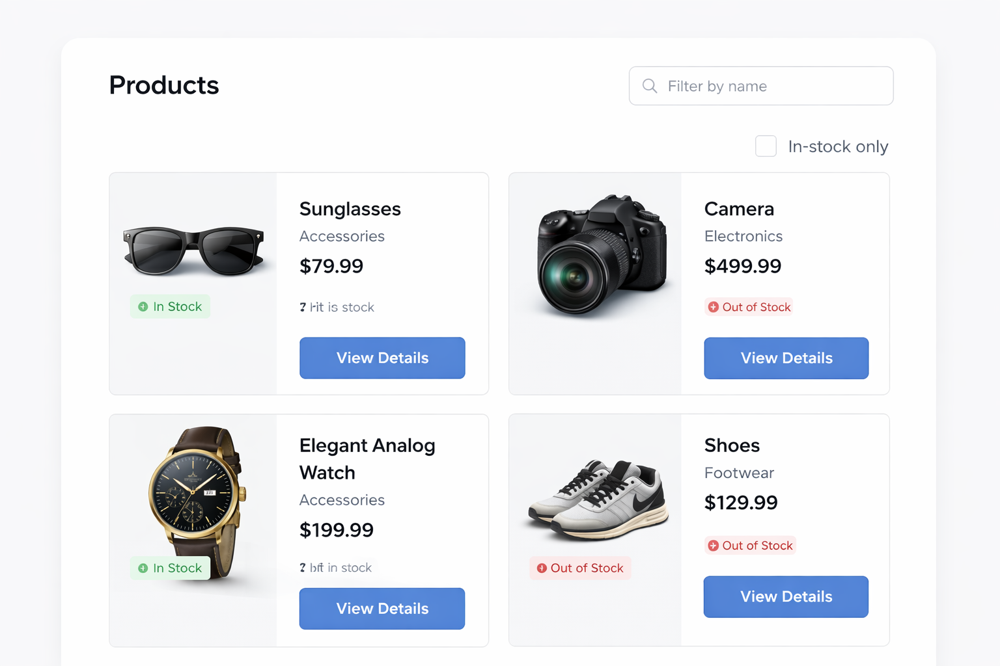
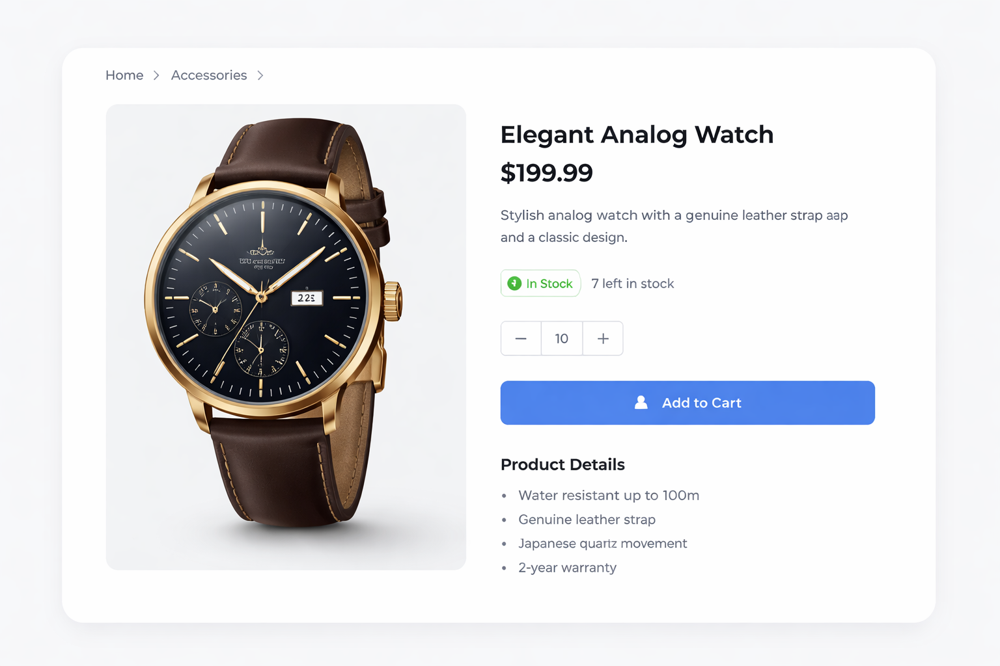

# Angular Coding Challenge

## Overview

Welcome! This is a **30–45 minute coding challenge** designed to test your Angular skills, including:

- Standalone components (Angular 21)
- TypeScript and typing
- Angular routing
- Async data handling with `HttpClient`
- Basic HTML/CSS and conditional rendering

You will work with a small app that displays a list of items and their details. Some items are **out of stock**, and your task is to extend the app with filtering and UI improvements.

To give you some inspiration for the UI, here are two examples:

2. **Product Listing Page**
   

   > Example of a responsive product grid with multiple items, prices, and in-stock badges.

1. **Modern Product Preview**
   
   > Example of a single product detail layout with clean typography, stock info, and actionable buttons.

These images are **for inspiration only**. You do not need to replicate them exactly, but consider similar layout, spacing, and style in your implementation.

---

## Architecture & Technical Documentation

For in-depth architectural analysis, design rationale, and engineering guides, explore the documentation in the [`docs/`](docs/) folder:

| Document                                                           | Description                                                                                                                                        |
| :----------------------------------------------------------------- | :------------------------------------------------------------------------------------------------------------------------------------------------- |
| 📋 [Architectural Decision Records (ADRs)](docs/adr.md)            | Architectural decision records documenting state mutation prevention, immutable data flow, functional interceptors, and root singleton lifecycles. |
| 🏗️ [High-Level System Architecture](docs/architecture.md)          | Detailed layer architecture, core services breakdown (`ItemStateService`, `ItemService`), domain models, and routing strategies.                   |
| 🛠️ [Developer Experience (DX) & Governance](docs/dx-governance.md) | Prettier configuration, Husky pre-commit hooks, and `lint-staged` rules.                                                                           |
| 🚀 [CI/CD Pipeline & Deployment Strategy](docs/cicd-deployment.md) | GitHub Actions CI matrix (`ci.yml`), production build optimizations, and Netlify deployment strategy.                                              |
| 📖 [Local Development Setup Guide](docs/setup-guide.md)            | Step-by-step setup guide for cloning, installing, testing, formatting, and running the application.                                                |

---

## Setup & Available Commands

The application is built with Angular 21 using standalone components and modern toolchains.

### Commands Overview

| Command                | Usage                  | Description                                                                                 |
| :--------------------- | :--------------------- | :------------------------------------------------------------------------------------------ |
| `npm start`            | `npm start`            | Launches local development server at `http://localhost:4200/` with hot reloading.           |
| `npm test`             | `npm test`             | Executes unit test suite across all `*.spec.ts` files using the test runner.                |
| `npm run build`        | `npm run build`        | Builds optimized production artifacts output to the `dist/` directory.                      |
| `npm run format`       | `npm run format`       | Runs Prettier to automatically format code files (`.ts`, `.html`, `.scss`, `.json`, `.md`). |
| `npm run format:check` | `npm run format:check` | Verifies code formatting across files with Prettier without modifying them.                 |
| `npm run prepare`      | `npm run prepare`      | Configures Husky pre-commit git hooks for automated formatting and testing.                 |

### Quick Start (Local Development)

```bash
# 1. Install dependencies
npm install

# 2. Run unit tests
npm test

# 3. Start development server
npm start
```
